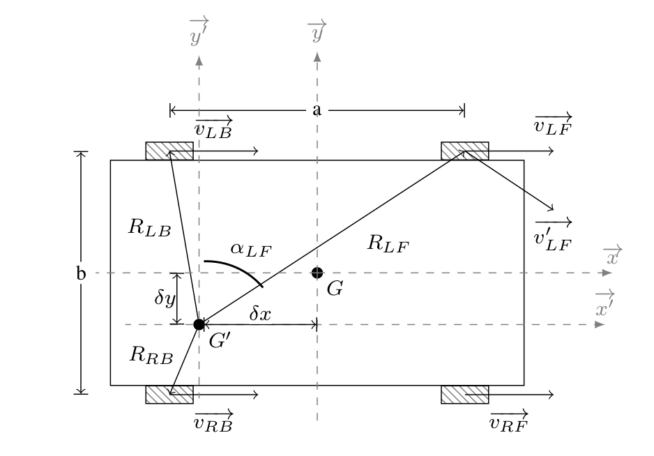

# 4-wheel differential driven robot kinematics model
## Assumptions
- The mobile robot frame and wheels are rigid body. 
- The centerof mass of the wheel is at its center of rotation.
- The center of the wheels are at same plane.

## Kinematics model
For a 4-wheel differential driven robot, there are four motors control each wheel. The linear or circular motion of the robot is determined by the speed of the four wheels together. When there is a difference in motor speed, the robot will slide by sliding friction due to the difference in **transverse speed** caused by the four wheels.

To describe the robot motion, a fixed world coordinate frame 

$$ \begin{bmatrix} x_g & y_g & \theta_g \end{bmatrix}^T \tag{1} $$

and a local coordinate frame with the robot motion whose origin is at the **center of mass (COM)** of the robot are set.

$$ \begin{bmatrix} x_l & y_l & \theta_l \end{bmatrix}^T \tag{2} $$ 

Here $x$ and $y$ represent the coordinates of the robot's position in the coordinate frame and the $\theta$ represents the orientation angle.

The relationship between these two frame showns below:

$$ \begin{bmatrix} \dot{x_g} \\ 
\dot{y_g} \\ 
\dot{\theta_g} 
\end{bmatrix} = \begin{bmatrix} cos\theta & -sin\theta & 0 \\ 
sin\theta & cos\theta & 0 \\ 
0 & 0 & 1 \end{bmatrix} 
\begin{bmatrix} \dot{x_l} \\ 
\dot{y_l} \\ 
\dot{\theta_l} 
\end{bmatrix} \tag{3} $$ 

Here is a schematic of 4-wheel robot. 

Although there are four drive wheels in this model, it can be simplified to a two-wheel drive-like model for the purpose of analysis.

In the local frame, it is easy to get $\dot{x_l}=\frac{r}{2}(\dot{\phi_L}+\dot{\phi_R})$ and $\dot{y_l}=0$.
To simplify the discussion of $\dot{\theta}$, assume the $G^\prime$ locate at $(\delta x,\delta y)$ in the local frame and here set $\delta y$ to be 0 for discussion. For the rotation speed $\dot{\theta}=\omega$

$$ \omega=\frac{v^\prime_{LB}}{R_{LB}}=\frac{u_Lcos\alpha_{LB}}{R_{LB}} \tag{4}$$

$$ \omega=-\frac{v^\prime_{RB}}{R_{RB}}=-\frac{u_Rcos\alpha_{RB}}{R_{RB}} \tag{5}$$

Due to the symmetry $R_{LB}=R_{RB}$ and $\alpha_{LB}=\alpha_{RB}$, we have 

$$ \omega=(u_L-u_R)\frac{cos\alpha_{LB}}{2R_{LB}}=(u_L-u_R)\frac{(\frac{b}{2})}{2[(\frac{b}{2})^2+(\frac{a}{2}-\delta x)^2]} \tag{6}$$

Eqn.6 can extend to Eqn.7

$$ \omega=(u_L-u_R)\frac{cos\alpha_{LB}}{2R_{LB}}=(u_L-u_R)\frac{(\frac{b}{2}-\delta y)}{2[(\frac{b}{2}-\delta y)^2+(\frac{a}{2}-\delta x)^2]} \tag{7}$$

$$ \beta=(\frac{(\frac{b}{2}-\delta y)}{2[(\frac{b}{2}-\delta y)^2+(\frac{a}{2}-\delta x)^2]})^{-1} \tag{8}$$
$$ \omega=\frac{(u_L-u_R)}{\beta} \tag{9}$$

For the parameter $\beta$, $a$ and $b$ are the geometric robot parameters but for $\delta x$ and $\delta y$ we need extra work. It is found by rotating the robot in place at different speeds, but making sure that $u_L=-u_R$ . Then least squares minimization of the error is used to find $\beta$.

For the Forward Kinematics:

$$ \begin{bmatrix}
    v_c\\ \omega
\end{bmatrix}=\begin{bmatrix}
    \frac{1}{2} & \frac{1}{2}\\
    \frac{1}{\beta} & \frac{1}{\beta}\\
\end{bmatrix} \begin{bmatrix}
    u_L\\ u_R
\end{bmatrix} \tag{10}$$

For the Inverse Kinematics:

$$ \begin{bmatrix}
    u_L\\ u_R
\end{bmatrix}=\begin{bmatrix}
    1 & \frac{\beta}{2}\\
    1 & -\frac{\beta}{2}\\
\end{bmatrix} \begin{bmatrix}
    v_c\\ \omega
\end{bmatrix} \tag{11}$$
